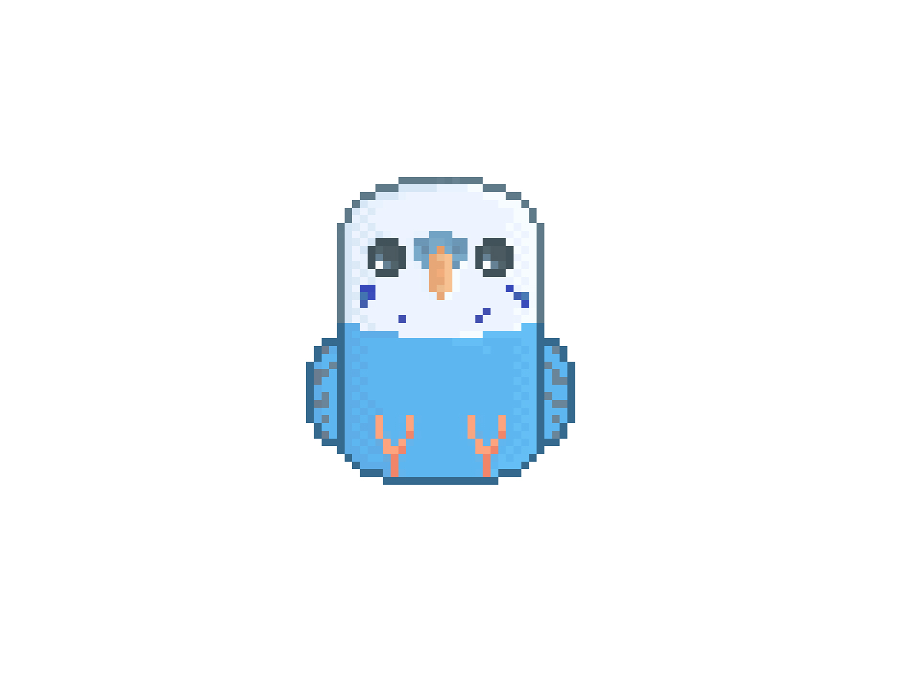
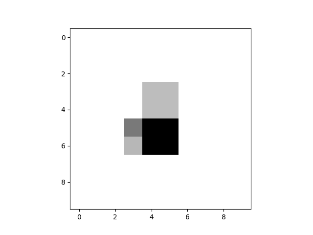
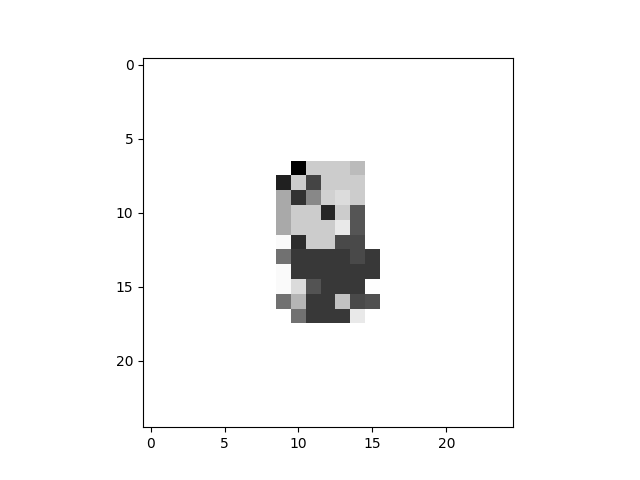
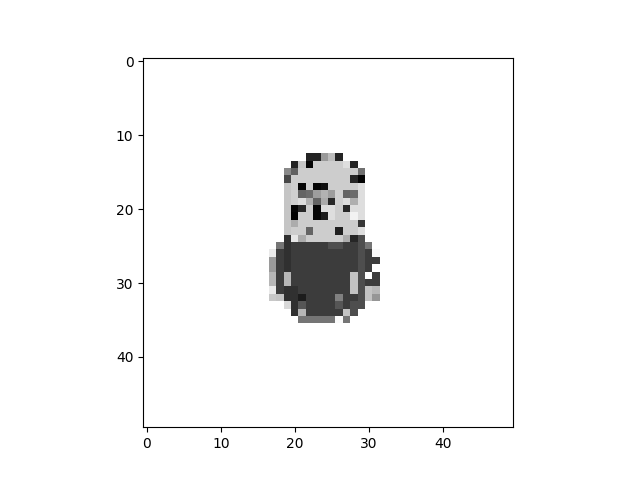
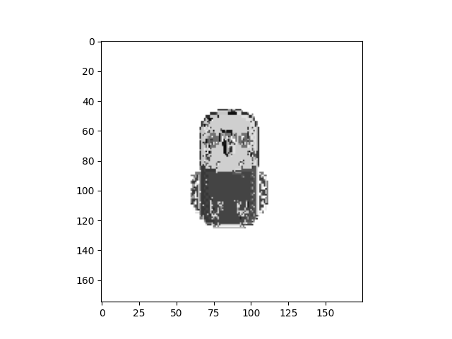
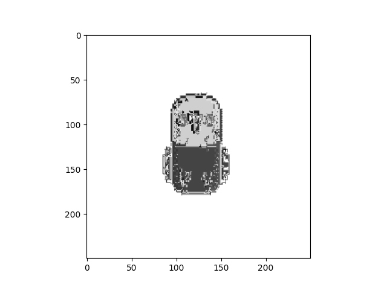
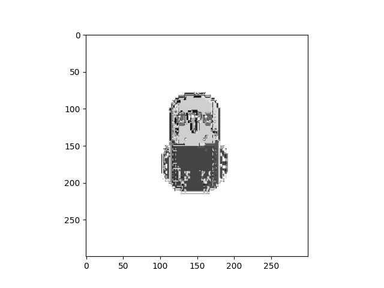

# Quantum Fourier Art

This project aims to generate an art piece from given image with use of Quantum Fourier Transform and Inverse Quantum
Fourier Transform.

## Installation and usage

1. Pull the remote repository

```
git pull https://github.com/MaciPaci/QuantumFourierArt.git
```

2. Create new virtualenv and install requirements

```
python3 -m venv "venv"
source venv/bin/activate
pip install -r requirements.txt
```

3. Add your api token to access remote quantum computing services to .env file. It can be
   found [here](https://quantum-computing.ibm.com/)

4. Run the script via `python ./main.py <path_to_image> <resolution>` for example

```
python ./main.py ./img/parrot.jpg 100
```

## Algorithm

This algorithm uses Quantum Fourier Transform to calculate Fourier Transform of the input image. This operation
transforms the image into a superposition of its component frequencies. To create an art image with quantum properties
such as noise and entanglement intertwined in an image Inverse Quantum Fourier Transform operation is needed to revert
the image back to the base vector space. This results in a base image with some quantum noise in it. The whole QFT and
IQFT operations are done using real quantum computers from IBM.

The general outline for this algorithm is as follows:

1. Import image data from file into memory
2. Preprocessing - resizing, transform from RGB to gray scale and flatten to 1D vector
3. Calculate Quantum Fourier Transform of each pixel of the image on an 8-qubit quantum circuit (8 qubits are needed to
   properly represent 0-255 range of gray scale pixel values)
4. Calculate Inverse Quantum Fourier Transform of each pixel of the image on an 8-qubit quantum circuit (in an ideal
   world this would result in a perfect reproduction of an input image)
5. Save resulting image to a file

### Switching between simulated and real quantum computers
To switch between quantum providers simply pass desired client into the job execution in `main.py`:
```
        job = execute(qc, <real/sim>, shots=1)
```

## Results

### Example input image:



### Image after transformations:

#### Resolution 10x10



#### Resolution 25x25



#### Resolution 50x50



#### Resolution 100x100


#### 175x175 175x175



#### Resolution 250x250



#### Resolution 300x300


